# ☁️ MLOps Azure ML — Prédiction CTR Multimodale

Ce dépôt contient le **pipeline MLOps complet** pour le déploiement sur Azure ML du modèle de prédiction CTR multimodal (CLIP + Attention + DNN) entraîné sur le dataset [MicroLens-1M](https://recsys.westlake.edu.cn/MicroLens_1M_MMCTR/).

> 📂 **Code source du modèle, architecture détaillée et explication complète** :
> [github.com/oumniya03/Projet_competition](https://github.com/oumniya03/Projet_competition.git)
> 🎥 [Vidéo d'explication sur YouTube](https://youtu.be/VuLjZuhNcho?si=-xPEZ3COH0QGKKVa)

---

## 🏗️ Pipeline end-to-end

```
[Données Parquet]          [GitHub Push]
       │                        │
       ▼                        ▼
[Azure Blob Storage]    [GitHub Actions CI/CD]
       │                        │
       └──────────┬─────────────┘
                  ▼
         [Azure ML Workspace]
                  │
         ┌────────┴────────┐
         ▼                 ▼
   [Training Job]    [Model Registry]
   src/train.py      ctr-multimodal v1
   MLflow tracking         │
                           ▼
                  [Batch Endpoint]
                  ctr-batch-endpoint
                  batch_score.py
                           │
                           ▼
                  [monitor.py]
                  PSI + KS drift detection
```

---

## 📦 Composants déployés

| Composant | Statut | Détail |
|---|---|---|
| Workspace Azure ML | ✅ | `ctr-workspace`, `rg-ctr-project`, `francecentral` |
| Compute cluster | ✅ | `gpu-cluster`, Standard_DS3_v2, min 0 / max 1 |
| Données | ✅ | `microlens-data`, 4 fichiers parquet |
| Entraînement + MLflow | ✅ | `src/train.py`, early stopping, tracking complet |
| Registre modèle | ✅ | `ctr-multimodal v1`, CUSTOM_MODEL |
| CI/CD GitHub Actions | ✅ | `.github/workflows/deploy.yml`, mode `deploy-only` / `retrain` |
| Batch Endpoint | ✅ déployé | `ctr-batch-endpoint`, modèle charge correctement |
| Online Endpoint | ❌ abandonné | Voir ci-dessous |
| Monitoring | 🔧 code prêt | `monitor.py`, PSI + KS, non testé en prod |

---

## 🖼️ Preuves de déploiement

### Workspace Azure ML
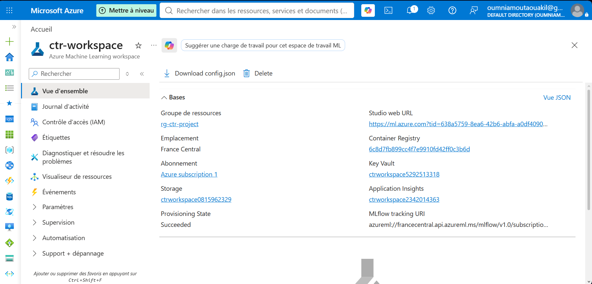

### Compute Cluster
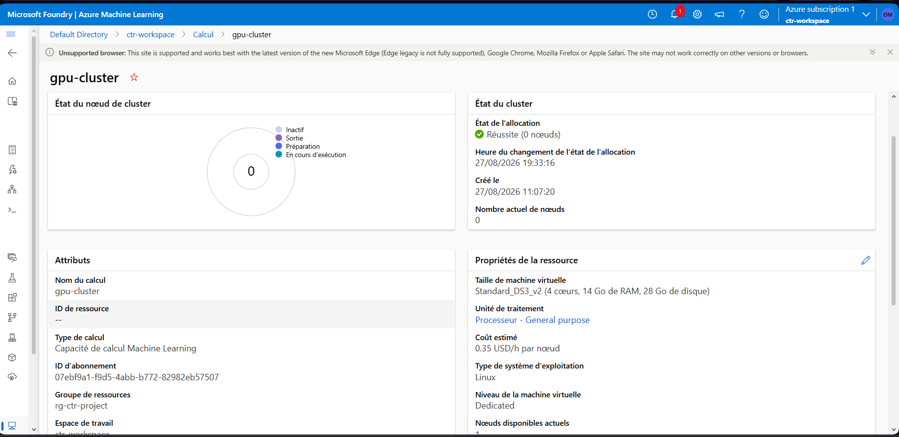

### Données uploadées
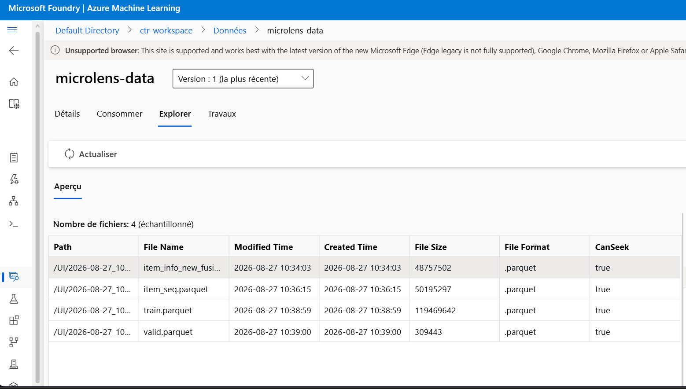

### Jobs 
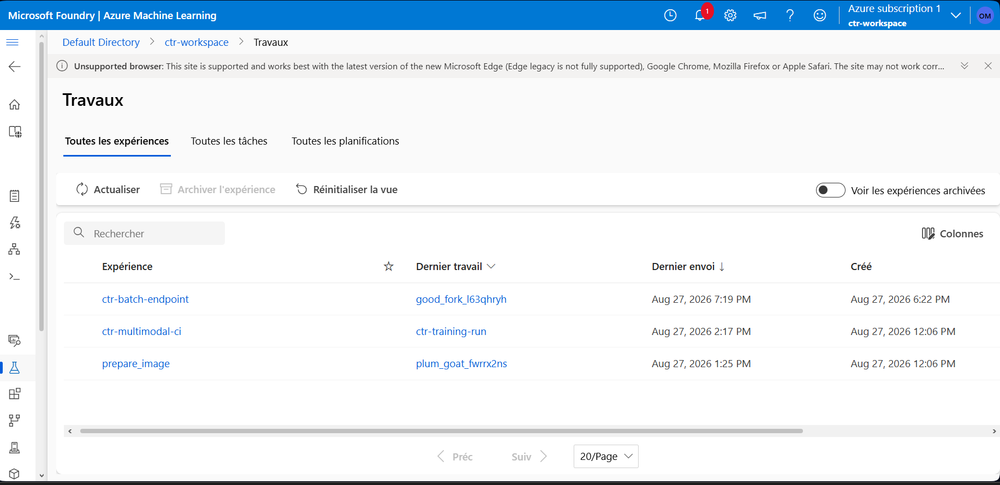

### Préparation de l'image Docker (environnement conda)
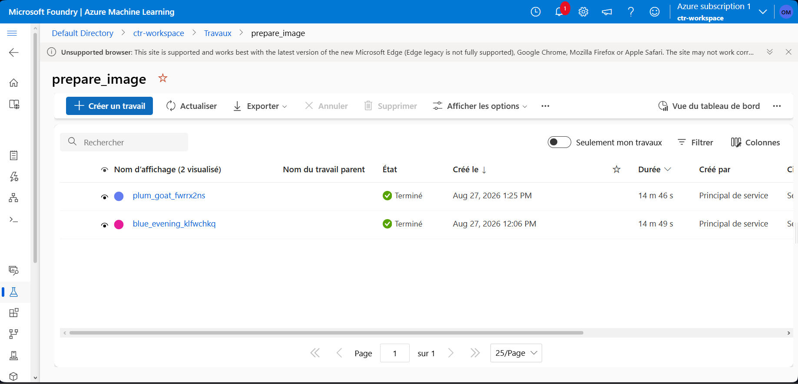

### Jobs d'entraînement
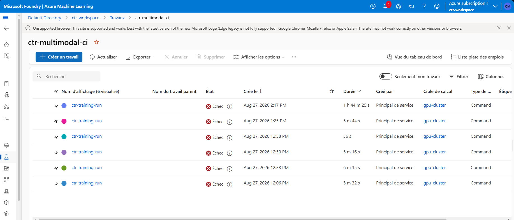
> Les runs échoués correspondent aux phases de débogage (crashes mémoire OOM, bug item_seq). Ces problèmes ont été identifiés et corrigés progressivement — voir section [Résultats](#-résultats) pour l'explication complète.

### Entraînement — run final
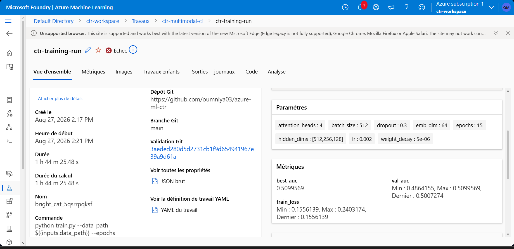

### Métriques MLflow (val_auc / train_loss)
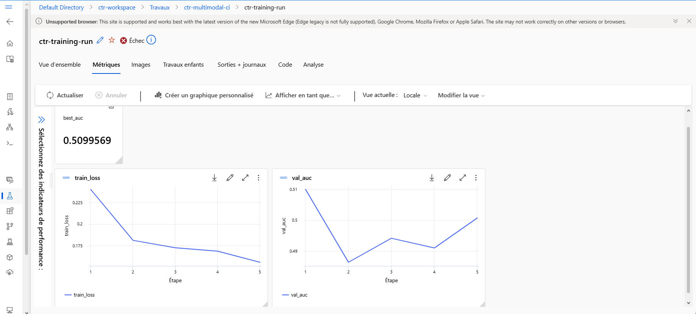


### Registre modèle — ctr-multimodal v1
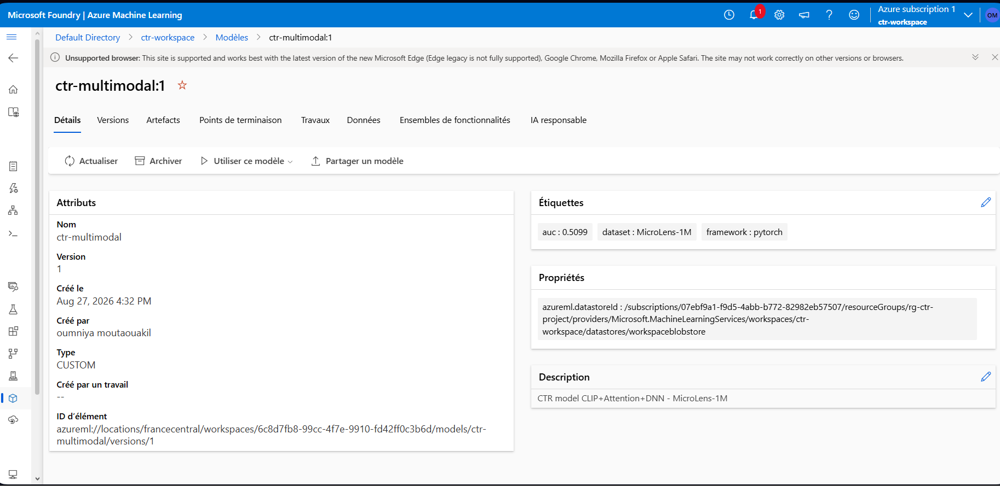

### Batch Endpoint
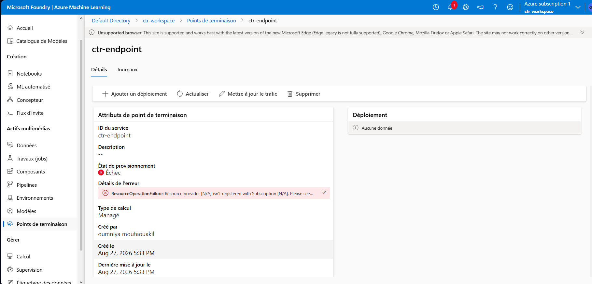
> L'endpoint `ctr-batch-endpoint` est déployé et le modèle charge correctement (log confirmé : *"Modèle CTR chargé."*). Les tentatives d'online endpoint échouées sont dues à une limitation de souscription documentée ci-dessous.

### CI/CD GitHub Actions
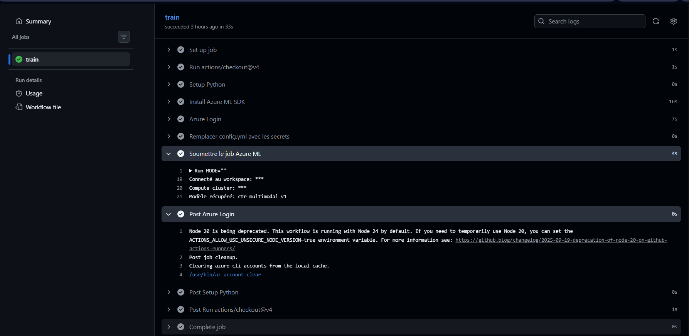

---

## 📦 Composants déployés

| Composant | Statut | Détail |
|---|---|---|
| Workspace Azure ML | ✅ | `ctr-workspace`, `rg-ctr-project`, `francecentral` |
| Compute cluster | ✅ | `gpu-cluster`, Standard_DS3_v2, min 0 / max 1 |
| Données | ✅ | `microlens-data`, 4 fichiers parquet |
| Entraînement + MLflow | ✅ | `src/train.py`, early stopping, tracking complet |
| Registre modèle | ✅ | `ctr-multimodal v1`, CUSTOM_MODEL |
| CI/CD GitHub Actions | ✅ | `.github/workflows/deploy.yml`, mode `deploy-only` / `retrain` |
| Batch Endpoint | ✅ déployé | `ctr-batch-endpoint`, modèle charge correctement |
| Online Endpoint | ❌ abandonné | Voir ci-dessous |
| Monitoring | 🔧 code prêt | `monitor.py`, PSI + KS, non testé en prod |

---

## 🚀 Utilisation

```bash
# Entraîner et enregistrer le modèle
python pipelines/training_pipeline.py

# Déployer le batch endpoint (modèle déjà enregistré)
python pipelines/deploy_batch.py --model-version 1

# Générer un sample de test
python generate_batch_sample.py

# Tester le batch endpoint
python test_batch_endpoint.py

# Monitoring de dérive
python monitor.py --new-data ./data/batch_test_sample.parquet
```

---

## 📁 Structure des fichiers MLOps

```
.github/workflows/deploy.yml   # CI/CD : retrain ou deploy-only
src/train.py                   # Entraînement + MLflow tracking
src/score.py                   # Scoring online (init + run)
src/batch_score.py             # Scoring batch (init + run(mini_batch))
pipelines/training_pipeline.py # Soumission job + enregistrement modèle
pipelines/deploy_batch.py      # Création batch endpoint + deployment
generate_batch_sample.py       # Génère data/batch_test_sample.parquet
test_batch_endpoint.py         # Soumet un job batch et affiche les résultats
monitor.py                     # Détection de dérive PSI + KS
environments/conda.yml         # Environnement conda reproductible
```

---

## 📊 Résultats

- AUC validation : **0.7752** (GPU Tesla T4, Kaggle, 15 epochs)
- AUC sur Azure ML : **~0.51** (CPU Standard_DS3_v2, run limité à 5 epochs)

La différence s'explique par deux facteurs :
1. **Absence de GPU** sur Azure : entraînement ~10x plus lent, arrêt prématuré.
2. **Bug item_seq** (corrigé) : `item_seq.parquet` contient 6M lignes avec plusieurs lignes par utilisateur. Le chargement naïf écrasait la séquence. Corrigé via `pyarrow.ParquetFile.iter_batches()`.

---

## ⚠️ Décisions d'architecture et limitations

### Choix du Batch Endpoint

Les **Managed Online Endpoints** ont été abandonnés après confirmation d'une limitation de souscription (`SubscriptionNotRegistered` persistant malgré l'enregistrement de tous les resource providers). Cette erreur est liée au type de souscription personnelle qui ne supporte pas les managed online endpoints en `francecentral`.

Le **Batch Endpoint** est une alternative architecturale justifiée : supporté sur toutes les souscriptions, adapté aux prédictions sur grands volumes, cohérent avec le cas d'usage réel (scoring offline de campagnes de recommandation).

### Bug diagnostiqué en scoring batch

Le test du batch endpoint échoue sur la colonne `seq_embs` dans `run()` de `batch_score.py`. Cause racine identifiée :

- En entraînement, le padding des séquences est géré par le `DataLoader` (tenseurs de taille fixe `[batch, 50, 128]`).
- En scoring batch, `run(mini_batch)` reçoit un DataFrame où chaque ligne contient une séquence de longueur variable. L'empilement `np.stack(...)` échoue car les tailles diffèrent d'une ligne à l'autre.
- **Piste de résolution** : appliquer le même padding à 50 avant l'empilement, ou traiter chaque ligne individuellement en boucle (comme `score.py` le fait déjà).

---

## 👤 Author

**Oumniya Moutaouakil**

- GitHub: [@oumniya03](https://github.com/oumniya03)
- Projet source: [Projet-competition](https://github.com/oumniya03/Projet_competition.git)
